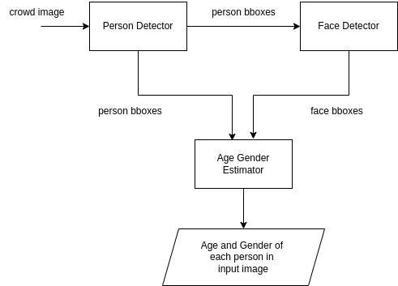

# Age and Gender Estimation in Crowd Scenes

## Overview
Most of the age and gender estimation models works on one or two person image. In this repo, age and gender estimation pipeline which is able to estimate in crowded scenes is built.

Currently, Mivolo (SOTA) model in age and gender estimation is trained on Lagenda Dataset. The model itself is very good at estimating if we can give person and face detected bounding boxes. The original detector used in Mivolo, YOLOv8 is not able to detect person and faces on crowded scenes.
So, I retrained detector part.

New pipeline structure:

* Person detector (YOLOX-m pretrained)
* Face detector (YOLOX-s)
* Age gender estimator (mivolo_d1)

 

Detail face detector training : [FaceDetecton.md](FaceDetection.md)

## Environment Setup

Venv


## Sample Output
| Mivolo | Crowd Pipeline |   
| :---:  | :---: | 
|  |    |
|  |       |

# References

```
@article{mivolo2023,
   Author = {Maksim Kuprashevich and Irina Tolstykh},
   Title = {MiVOLO: Multi-input Transformer for Age and Gender Estimation},
   Year = {2023},
   Eprint = {arXiv:2307.04616},
}
```
```
@article{mivolo2024,
   Author = {Maksim Kuprashevich and Grigorii Alekseenko and Irina Tolstykh},
   Title = {Beyond Specialization: Assessing the Capabilities of MLLMs in Age and Gender Estimation},
   Year = {2024},
   Eprint = {arXiv:2403.02302},
}
```
```
 @article{yolox2021,
  title={YOLOX: Exceeding YOLO Series in 2021},
  author={Ge, Zheng and Liu, Songtao and Wang, Feng and Li, Zeming and Sun, Jian},
  journal={arXiv preprint arXiv:2107.08430},
  year={2021}
}
```


