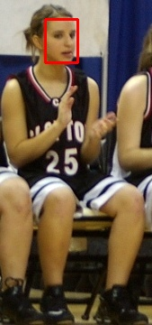

## YOLOX Face Detection Training

### Lagenda Dataset

Lagenda Dataset contain 67,159 images. \
Only 5000 images with face annotations are extracted.  \
Training images : 3000 \
Valid images : 3000

### Prepare face detection dataset

Each person crops are saved as an image with face crop annotation with respect to cropped image.

YOLOX is trained with each person crop images for face detection.

The dataset preparation can be easily done by a few python scripts.
It is better to implement the customized script by one-self based on requirement. 

### Dataset example

|  |  |   |  |
| :---:  | :---: | :---: | :---: |
| |   |  |  |

### Training weight

Yolox_s_face.pth : [ download link](https://github.com/myatmyintzuthin/crowd_age_gender_estimation/releases/tag/face_detection_weight)

This is just a trial model trained on 3000 images with 10 epochs without multi-scaling.

If you want more accuracy, it is better to train with more data.

